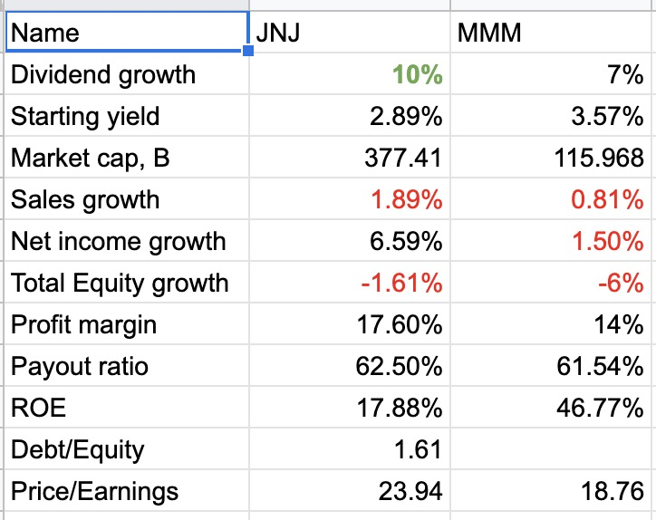

This tool will aggregate core financial indicators of companies for convenient comparison.
Example:


Enable Google Sheets API - https://developers.google.com/sheets/api/quickstart/python

Place `credentials.json` file into project's root.

Install dependencies with:
```
pip3 install --upgrade google-api-python-client google-auth-httplib2 google-auth-oauthlib yfinance --no-cache-dir
```

Run `python3 start.py` to create stock analysis spreadsheet